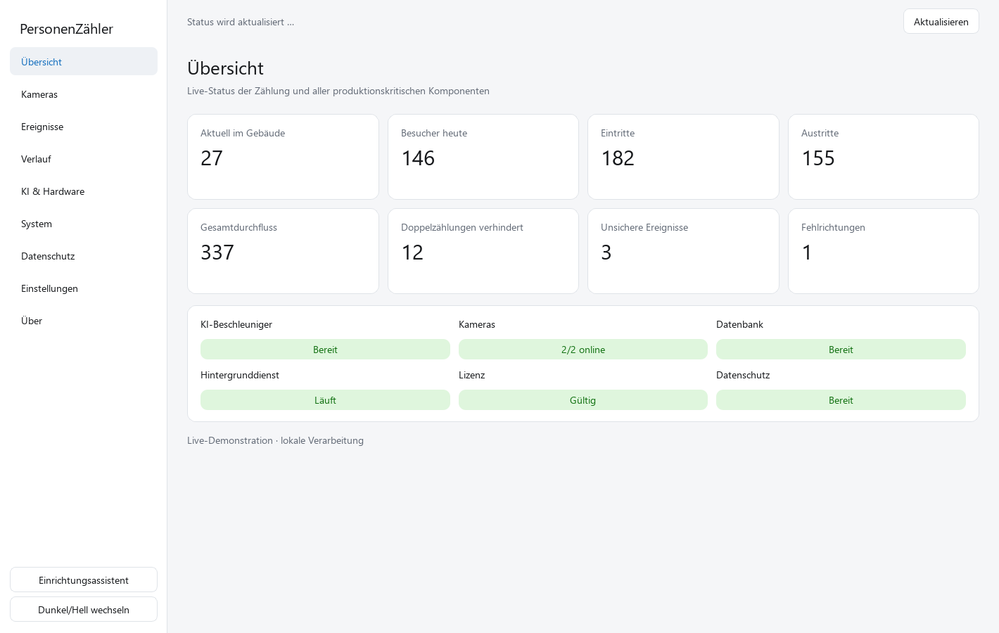

# PersonenZähler Desktop Suite

PersonenZähler ist eine native Linux-Desktop-Anwendung für lokale, Hailo-beschleunigte Besucher- und Belegungszählung auf einem Raspberry Pi 5 mit aktuellem 64-Bit Raspberry Pi OS (Trixie). Die Produktionsarchitektur verwendet zwei konfigurierbare Kameraquellen, YOLO26m auf Hailo-10H, lokales Tracking, temporäre OSNet-Re-ID, kameraübergreifenden Consensus und eine lokale SQLite-Datenbank.



## Schnellinstallation für Raspberry Pi OS

Die Installation aus dem Quellcode inklusive Menüeintrag, lokaler virtueller
Umgebung, Diagnose und Hailo-10H-Treiberprüfung ist mit zwei Terminalzeilen möglich:

```bash
curl -fsSL https://raw.githubusercontent.com/1234Taschenlampe/PersonenZ-hler/main/scripts/quick_install.sh -o /tmp/personenzaehler-install.sh
bash /tmp/personenzaehler-install.sh
```

Anschließend das Programm über das Raspberry-Pi-Anwendungsmenü öffnen, unter
**Kameras** private LAN-Kameras suchen oder Reolink-IP und Zugangsdaten manuell
eintragen. Nach erfolgreichem Kameratest die passenden Hailo-10H-HEFs importieren.
Für den Präsentationstest gilt die [Raspberry-Pi-Abnahmecheckliste](docs/PRESENTATION_SETUP.md).
Der Installer lädt die offiziellen Hailo-10H-Modelle mit SHA-256-Prüfung nach.
Quellen, direkte Herstellerdownloads, Urheber und Lizenzhinweise stehen unter
[Modellquellen & Credits](docs/MODEL_SOURCES_AND_CREDITS.md). Bei einem
Netzwerk-/Kompatibilitätsfehler bleiben Einrichtung und Diagnose verfügbar;
die Modelle lassen sich unter **KI & Hardware** mit einem Klick nachladen.
**Wichtig:** Die YOLO26m- und OSNet-HEFs sind nicht Teil dieses Git-Repositories,
werden aber beim Einrichten direkt von Hailo heruntergeladen. Installation
allein bedeutet noch keine einsatzfähige Erkennung: HailoRT, Firmware und
echte Kamera-Inferenz müssen auf dem Pi geprüft werden.
Ein Neuaufsetzen des Pi ist normalerweise nicht erforderlich.

## Installation für Anwender

1. Das ARM64-Paket `personenzaehler_1.0.0_arm64.deb` aus dem GitHub-Actions-Artefakt laden.
2. Die Datei im grafischen Paketinstaller von Raspberry Pi OS/Debian öffnen und **Installieren** wählen.
3. **PersonenZähler** aus dem App-Menü starten.
4. Den Einrichtungsassistenten abschließen.

Für Installation und normalen Betrieb sind keine Python-, Shell- oder `systemctl`-Befehle nötig. Das Paket installiert Desktop-Starter, Icon, MIME-Typ, PolicyKit-Helfer, Systemdienste, sichere Laufzeitverzeichnisse und automatisch erzeugte API-/Datenschlüssel. Details stehen in der [Installationsanleitung](docs/INSTALLATION.md).

HailoRT und die Firmware sind hardwarespezifische Herstellerkomponenten. Die Anwendung erkennt fehlende Komponenten und meldet **KI-Beschleuniger nicht bereit**; sie startet keinen versteckten CPU-, Dummy- oder Ersatzmodellpfad. Die beiden produktiven HEF-Dateien werden über **KI & Hardware** importiert.

## Funktionsumfang

- moderne native PySide6-Oberfläche mit Sidebar, Cards, Light/Dark Mode und Hintergrund-Workern
- First-Run-Assistent für System, Hailo, Modelle, Kameras, Datenschutz, API und Lizenz
- getrennte Zähler für aktuelle Belegung, eindeutige Tagesbesucher, Eintritte, Austritte und Gesamtdurchfluss
- Doppelzählungsunterdrückung, unsichere Entscheidungen und konfigurierbare Fehlrichtungsereignisse
- USB/V4L2- sowie RTSP/RTSPS/HTTP(S)-Kameras mit Rollen und Richtungskonfiguration
- lokaler Produktionsdienst und versionierte REST-/WebSocket-API
- Android-Monitoring einschließlich Status, Events, Video-Endpunkte und additive Zählerfelder
- grafische Serviceverwaltung, Logs, Hardwareprüfung, Modell-/Lizenz-/TLS-Import und redigierter Diagnoseexport
- signierte Ed25519-Lizenzen; der private Herausgeberschlüssel ist nicht Bestandteil des Repositorys oder Pakets
- datenschutzfreundliche Voreinstellungen: lokale Verarbeitung, keine Aufzeichnung, keine Gesichtserkennung, granulare Ereignisse aus

## Zählmodell

- **Aktuell im Gebäude:** ändert sich nur durch bestätigte Linienübertritte, nicht durch sichtbare Bounding Boxes.
- **Besucher heute:** zählt temporäre Re-ID-Profile pro lokalem Kalendertag einmal. Profile werden beim Tageswechsel gelöscht; persistierte Profile sind verschlüsselt.
- **Eintritte/Austritte:** persistente, getrennte Passagezähler.
- **Gesamtdurchfluss:** Eintritte plus Austritte, einschließlich späterer Wiederkehr derselben Person.
- **Fehlrichtungen:** ansonsten valide, aber nicht als Ein-/Austritt konfigurierte Übergänge; sie verändern die Belegung nicht.

Re-ID erzeugt keine reale Identität, keinen Namen und keine Gesichtserkennung. Ohne verfügbaren Datenschutzschlüssel bleibt der Tageszähler im RAM und wird transparent als eingeschränkt neustartfest markiert.

## Bedienung

Die neun Bereiche der Anwendung sind **Übersicht**, **Kameras**, **Ereignisse**, **Verlauf**, **KI & Hardware**, **System**, **Datenschutz**, **Einstellungen** und **Über**. Administrative Aktionen werden eng begrenzt über PolicyKit bestätigt; die GUI selbst läuft nie als Root. Das [Benutzerhandbuch](docs/USER_MANUAL.md) beschreibt Einrichtung, Android-Pairing, Diagnose und Fehlerbilder.

## Datenschutz und Sicherheit

PersonenZähler stellt technische Privacy-by-Design-Maßnahmen bereit. Das bedeutet nicht, dass jeder konkrete Kameraeinsatz automatisch DSGVO-konform ist. Der Betreiber muss insbesondere Zweck, Rechtsgrundlage, Transparenzinformation, Erfassungsbereich, Speicherdauer, Zugriffsrechte und eine mögliche DSFA/DPIA für seinen Einsatz bewerten.

- keine permanente Video- oder Bildspeicherung im Standardbetrieb
- keine Gesichtserkennung, Namen oder dauerhafte biometrische Identitätsdatenbank
- lokale Hailo-Verarbeitung und externe Telemetrie gesperrt
- Remote-Livebild standardmäßig aus; Netzwerk-API außerhalb Loopback nur mit Authentifizierung und TLS
- rollenbasierte Zufallstokens, redigierte Logs/Diagnose und kurze Retention
- optionale granulare Ereignisse nur verschlüsselt
- tägliche Löschung temporärer Re-ID-Profile

Siehe [Datenschutz- und Sicherheitskonzept](docs/PRIVACY_AND_SECURITY.md), [DSGVO-Dokumentation](docs/DSGVO_DOKUMENTATION.md) und [technisches Security Review](docs/SECURITY_REVIEW.md).

## Architektur und Feature-Erhalt

Die Desktop-GUI ist von Produktionsdienst und Inferenz getrennt. Application/Core, Kamera, Inferenz, Tracking/Re-ID, Counter, Datenbank, API, Privacy/Security, Diagnose, Serviceverwaltung und Packaging besitzen klar abgegrenzte Module. Die vollständige Historie wurde geprüft; wiederhergestellte V2-, WLAN-/Re-ID-, Lizenz-, API-, Android- und Tageszählerfunktionen bleiben mit ihrer Git-Ancestry erhalten.

- [Aktuelle Architektur](docs/ARCHITECTURE.md)
- [Historien- und Feature-Audit](docs/FEATURE_HISTORY_AUDIT.md)
- [V2-Architektur](docs/ARCHITECTURE_V2.md)
- [Android-App](docs/ANDROID_APP.md)
- [Lizenzsystem](docs/LICENSE_SYSTEM.md)

## Entwicklerinstallation

Die Terminalschritte in diesem Abschnitt richten sich ausschließlich an Entwicklung und CI:

```bash
python3 -m venv --system-site-packages .venv
. .venv/bin/activate
python -m pip install -e .
pytest
PYTHONPATH=src python -m visitor_counter.emulator
python scripts/build_deb.py --architecture arm64
```

Hardwaretests sind mit `hardware` markiert. Emulator und Tests dürfen synthetische Daten nutzen; der Produktionsdienst darf das nicht.

## Build und CI

GitHub Actions prüft Python 3.11/3.12, GUI-Smoke-Tests im Offscreen-Modus, Counter/Datenbank/API/Auth/Lizenz/Privacy-Regressionen, den Digital Twin, Python-Compile-Checks, Security-/Dependency-Audits, Secret-Pattern-Guard und reproduzierbaren DEB-Build. Große Binärdateien und HEFs werden nicht als normale Git-Dateien eingecheckt.

Ein AppImage ist derzeit bewusst kein Primärartefakt: HailoRT, Kernel-/Firmwareintegration, Gerätezugriffe und systemd/PolicyKit lassen sich nicht zuverlässig in ein portables Einzeldateiformat kapseln. Das DEB bleibt der unterstützte Produktionsweg.

## Projektstatus

Software-, GUI-, API-, Datenbank-, Datenschutz- und Packaging-Verhalten sind hardwareunabhängig testbar. Aussagen zu realer Erkennungsgenauigkeit, Hailo-Latenz, Temperatur und WLAN-Stabilität erfordern Abnahmemessungen auf dem Zielgerät; die dafür vorgesehenen Hardwaretests und Diagnoseansichten sind separat dokumentiert.
